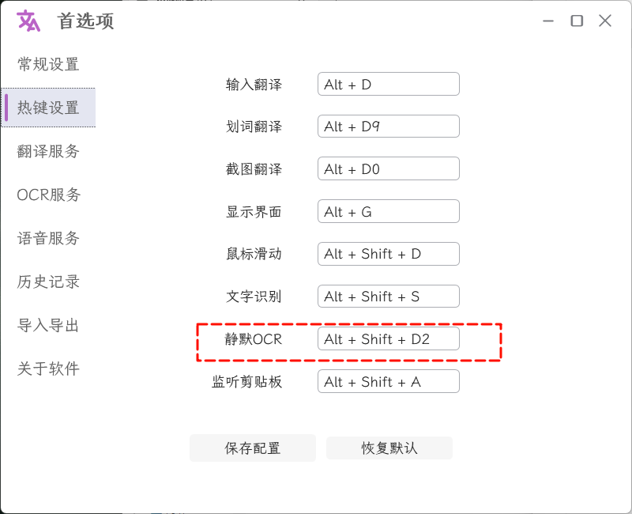
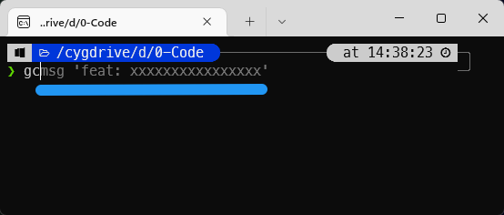

# Windows2Mac&Vim

> 换了环境，只能用Windows，所以配置各种工作流软件，适应Windows的Mac化操作和Vim的操作。

## 静默文本OCR

[STranslate](https://github.com/zggsong/stranslate)


## 改键

一开始使用 `PowerToys` 进行改键，后发现太难用了，而且改的规则有很多[问题]( https://eli-ven.github.io/posts/shortcuts/)。后面改为使用[AutoHotkey](https://www.autohotkey.com/)进行改键。这是我的配置[配置](./assets/maps.ahk)。但是`PowerToys`里面的`PowerToys Run`功能很强大，我只使用3个插件， 提升我的工作开发效率：

- [ClipboardManager](https://github.com/CoreyHayward/PowerToys-Run-ClipboardManager)
- [Everything](https://github.com/lin-ycv/EverythingPowerToys)
- [Translator](https://github.com/N0I0C0K/PowerTranslator)

> 将软件放到开机启动目录下`{C:\Users\${username}\AppData\Roaming\Microsoft\Windows\Start Menu\Programs\Startup}`

## 配置终端

<strike>
cygwin   安装时选个zsh


配置终端样式

- cygwin/zsh/on-my-zsh/p10k
- [字体](https://github.com/romkatv/powerlevel10k?tab=readme-ov-file#meslo-nerd-font-patched-for-powerlevel10k)

</strike>



<strike>

使用[PowerShell](https://github.com/PowerShell/PowerShell)配置[starship](https://github.com/starship/starship) 和windows自带的wsl 启动一个Ubuntu系统
</strike>

>  如果你使用的是 windows 自带的 powershell , 那么它的配置文件是C:\Users\<用户名>\Documents\WindowsPowerShell\Microsoft.PowerShell_profile.ps1 , 如果没有这个文件, 自己新建一个。如果你使用的不是系统自带的 powershell , 而是自己安装的 powershell, 例如 PowerShell/PowerShell, 那么配置文件在 C:\Users\<用户名>\Documents\PowerShell\Microsoft.PowerShell_profile.ps1

- 写入内容
```ps1

# starship
Invoke-Expression (&starship init powershell)

```

- 现在的配置:

使用[tabby](https://github.com/eugeny/tabby)启动wsl的Ubuntu系统
Ubuntu系统里面配置了oh-my-zsh


## 配置输入法-rime

在 Windows 下的 rime（小狼毫）现在也可以配置 vim_mode 了。

为了使用切换应用后，可以切换对应的大小写模式。需要下载[每夜构建的版本](https://github.com/rime/weasel/releases/tag/latest)

weasel.custom.yaml
```yaml
patch:
  'app_options/+':
    code.exe: # 这里是应用可执行文件的名字，带后缀
      inline_preedit: false # 在输入法中预编辑，防止 vscode vim 中输入法闪烁
      ascii_mode: true
      vim_mode: true
```

推荐：一个输入法方案-[四叶草](https://github.com/fkxxyz/rime-cloverpinyin)


## 窗口切换-[window-switcher](https://github.com/sigoden/window-switcher)

配置

```ini
# Whether to show trayicon, yes/no
trayicon = yes

[switch-windows]

# Hotkey to switch windows
hotkey = alt+`

# List of hotkey conflict apps
# e.g. game1.exe,game2.exe
blacklist =

# Ignore minimal windows
ignore_minimal = no

[switch-apps]

# Whether to enable switching apps
enable = yes

# Hotkey to switch apps
hotkey = alt+tab

# Ignore minimal windows
ignore_minimal = no

```

## VSCoode

vim配置

- [settings.json](./assets/settings.json)
- [keybindings.json](./assets/keybindings.json)


## 软件管理器

choco

> https://community.chocolatey.org/packages

## Vscode 配置

- 主题使用 插件`Evondev Dracula` 的 `Evondev Dracula Darker Contrast`
- 编辑器字体使用 `FiraCode-Medium`
- 终端字体使用 `FiraCode Nerd Font Propo`

## 问题

小狼毫输入法跟vscode的冲突

1. vscode快捷键`ctrl + ,`设置为切换终端窗口, 和输入法的 切换符号冲突

禁用对应输入法的`xxxx.key_bindings.yaml`这2行

```yaml

windows_compatible_mode_switch:
  __append:
    - { when: always, accept: Shift+space, toggle: full_shape }
    # - { when: always, accept: Control+comma, toggle: ascii_punct }
    # - { when: always, accept: Control+period, toggle: ascii_punct }
    - { when: always, accept: Control+Shift+f, toggle: zh_simp_s2t }
    - { when: always, accept: Control+Shift+F, toggle: zh_simp_s2t }
```

2. 小狼毫指定应用切换vim模式

vsCode版本不一样，进程名不一样 (用户版本的vsCode 进程名为 `Code.exe`)

> 打开任务管理器查看进程名就行


